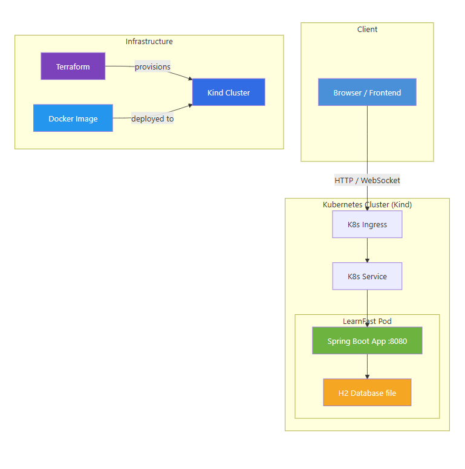

# LearnFast — Платформа за менторство и обучение


LearnFast е уеб приложение за свързване на ученици с ментори. Поддържа регистрация, чат в реално време (WebSocket), управление на сесии, ревюта и администраторски панел.

---

## 📐 Архитектура



> Диаграмата се намира в `docs/architecture.mmd` (Mermaid формат).

**Компоненти:**
- **Frontend** — статични HTML/CSS/JS файлове, сервирани от Spring Boot
- **Backend** — Spring Boot REST API + WebSocket
- **Database** — H2 (file-based), вградена в приложението
- **Инфраструктура** — Docker → Kind (Kubernetes in Docker) → Terraform за provisioning

---

## 🚀 Инструкции за стартиране

### Предварителни изисквания

| Инструмент | Версия |
|------------|--------|
| Java JDK | 17+ |
| Maven | 3.8+ |
| Docker | 20.10+ |
| Kind | 0.20+ |
| Terraform | 1.5+ |
| kubectl | 1.27+ |

### 1. Локално стартиране (без Docker)

```bash
# Клониране на проекта
git clone https://github.com/TUES-2026-PBL-11-klas/smes-learnfast.git
cd learnfast

# Билд и стартиране
mvn clean package -DskipTests
java -jar target/learnfast-1.0-SNAPSHOT.jar
```

Приложението ще е достъпно на **http://localhost:8080**

### 2. Стартиране с Docker

```bash
# Билд на Docker image
docker build -t <your-dockerhub-username>/learnfast:latest .

# Стартиране на контейнер
docker run -d \
  --name learnfast \
  -p 8080:8080 \
  -v learnfast-data:/app/data \
  <your-dockerhub-username>/learnfast:latest
```

### 3. Деплой с Kind + Terraform

```bash
# Стъпка 1: Създаване на Kind клъстер
kind create cluster --name learnfast

# Стъпка 2: Зареждане на Docker image в Kind
docker build -t <your-dockerhub-username>/learnfast:latest .
docker push <your-dockerhub-username>/learnfast:latest
kind load docker-image <your-dockerhub-username>/learnfast:latest --name learnfast

# Стъпка 3: Прилагане на Terraform конфигурация
cd terraform/
terraform init
terraform apply -auto-approve

# Стъпка 4: Проверка на деплоймента
kubectl get pods
kubectl get services

# Стъпка 5: Port-forward за достъп
kubectl port-forward svc/learnfast-service 8080:8080
```

Приложението ще е достъпно на **http://localhost:8080**

### Спиране и изтриване

```bash
# Изтриване на Kind клъстер
kind delete cluster --name learnfast

# Или изтриване само на Terraform ресурсите
cd terraform/
terraform destroy -auto-approve
```

---

## 🛠 Технологии и версии

| Категория | Технология | Версия |
|-----------|-----------|--------|
| Език | Java | 17 |
| Framework | Spring Boot | 3.2.0 |
| База данни | H2 (file-based) | вградена |
| WebSocket | Spring WebSocket (STOMP) | вградена |
| Validation | Spring Boot Starter Validation | 3.2.0 |
| Сигурност | Spring Security Crypto (BCrypt) | 6.2.1 |
| Билд | Maven | 3.8+ |
| Тестове | Spring Boot Starter Test | 3.2.0 |
| Code Coverage | JaCoCo | 0.8.11 (min 50%) |
| Code Style | Checkstyle | 3.3.0 |
| Test Runner | Maven Surefire | 3.2.5 |
| Контейнеризация | Docker | 20.10+ |
| Registry | Docker Hub | — |
| Оркестрация | Kubernetes (Kind) | 0.20+ |
| IaC | Terraform | 1.5+ |
| JDK Runtime | Eclipse Temurin | 17 |
| Мониторинг | Prometheus | 2.x |
| Визуализация | Grafana | 10.x |
---

## 📡 API Endpoints

### Автентикация (`/api/auth`)

| Метод | Endpoint | Описание |
|-------|----------|----------|
| POST | `/api/auth/register` | Регистрация на нов потребител |
| POST | `/api/auth/login` | Вход в системата |
| POST | `/api/auth/logout` | Изход от системата |
| GET | `/api/auth/me` | Текущ потребител (от сесията) |

**Регистрация — тяло на заявката:**
```json
{
  "username": "ivan",
  "email": "ivan@example.com",
  "password": "pass123",
  "role": "STUDENT",
  "name": "Иван Иванов",
  "age": 22,
  "bio": "Уча програмиране"
}
```

### Потребители и ментори (`/api`)

| Метод | Endpoint | Описание |
|-------|----------|----------|
| GET | `/api/mentors` | Списък на всички ментори |
| GET | `/api/mentors/{id}` | Детайли за ментор |
| PUT | `/api/profile` | Обновяване на профил |
| PUT | `/api/profile/subjects` | Обновяване на предмети на ментор |

### Сесии (`/api/sessions`)

| Метод | Endpoint | Описание |
|-------|----------|----------|
| POST | `/api/sessions` | Създаване на нова сесия |
| GET | `/api/sessions` | Списък на сесиите за потребителя |
| PUT | `/api/sessions/{id}/accept` | Приемане на сесия (ментор) |
| PUT | `/api/sessions/{id}/reject` | Отхвърляне на сесия (ментор) |

### Ревюта (`/api/reviews`)

| Метод | Endpoint | Описание |
|-------|----------|----------|
| POST | `/api/reviews` | Добавяне на ревю |
| GET | `/api/reviews/mentor/{mentorId}` | Ревюта за ментор |

### Чат (`/api/chat`)

| Метод | Endpoint | Описание |
|-------|----------|----------|
| GET | `/api/chat/history/{userId}` | История на чат с потребител |
| GET | `/api/chat/contacts` | Списък на чат контакти |

**WebSocket:** `/ws` (STOMP протокол)
- Subscribe: `/user/queue/messages`
- Send: `/app/chat.send`

### Администрация (`/api/admin`)

| Метод | Endpoint | Описание |
|-------|----------|----------|
| GET | `/api/admin/users` | Всички потребители |
| DELETE | `/api/admin/users/{id}` | Изтриване на потребител |
| GET | `/api/admin/subjects` | Всички предмети |
| POST | `/api/admin/subjects` | Добавяне на предмет |
| DELETE | `/api/admin/subjects/{id}` | Изтриване на предмет |

> **H2 Console:** достъпна на `/h2-console` (JDBC URL: `jdbc:h2:file:./data/learnfast`)

---

## 📁 Структура на проекта

```
src/main/
├── java/com/learnfast/
│   ├── LearnFastApplication.java      # Входна точка на приложението
│   ├── config/
│   │   ├── DataInitializer.java       # Инициализация на начални данни (роли, предмети)
│   │   ├── WebConfig.java             # CORS и статични ресурси
│   │   └── WebSocketConfig.java       # WebSocket/STOMP конфигурация
│   ├── controller/
│   │   ├── AdminController.java       # CRUD за потребители и предмети (админ)
│   │   ├── AuthController.java        # Регистрация, логин, логаут
│   │   ├── ChatController.java        # REST + WebSocket чат
│   │   ├── ReviewController.java      # Ревюта за ментори
│   │   ├── SessionController.java     # Менторски сесии
│   │   └── UserController.java        # Профили и списък ментори
│   ├── dto/                           # Data Transfer Objects
│   ├── model/                         # JPA Entity класове
│   │   ├── User.java                  # Потребител (студент/ментор/админ)
│   │   ├── Role.java                  # Роля (STUDENT, MENTOR, ADMIN)
│   │   ├── Subject.java               # Учебен предмет
│   │   ├── MentorSession.java         # Менторска сесия (PENDING/ACCEPTED/...)
│   │   ├── Review.java                # Ревю с рейтинг
│   │   └── ChatMessage.java           # Чат съобщение
│   ├── repository/                    # Spring Data JPA репозиторита
│   └── service/                       # Бизнес логика
├── resources/
│   ├── application.properties         # Конфигурация (H2, порт, сесия)
│   └── static/frontend/              # Статичен frontend
│       ├── css/                       # Стилове
│       ├── js/                        # JavaScript логика
│       └── pages/                     # HTML страници
├── Dockerfile                         # Multi-stage Docker билд
├── terraform/                         # Terraform IaC конфигурация
└── k8s/                               # Kubernetes
```

---

## ✅ Качество на кода

- **JaCoCo** — минимално покритие: **50%** (line coverage). Билдът ще fail-не ако не е покрито.
- **Checkstyle** — код стил проверки (`checkstyle.xml`), `failOnViolation=true`.
- **Maven Surefire** — test runner (v3.2.5).

```bash
# Пускане на тестове с coverage
mvn clean verify

# Само тестове (без coverage check)
mvn test

# Checkstyle проверка
mvn checkstyle:check
```

Coverage репорт: `target/site/jacoco/index.html`

---

## 📝 Допълнителна информация

- **Роли:** `STUDENT`, `MENTOR`, `ADMIN` — задават се при регистрация
- **Пароли:** хеширани с **BCrypt** (Spring Security Crypto 6.2.1)
- **Сесии на приложението** се управляват чрез HTTP сесии (server-side, 30 мин. timeout)
- **Данните** се съхраняват във файлова H2 база в `/app/data/` (persist-ва се чрез Docker volume)
- **CORS** е конфигуриран за разрешаване на заявки от всички origins (development mode)
- **Docker Registry:** Docker Hub
